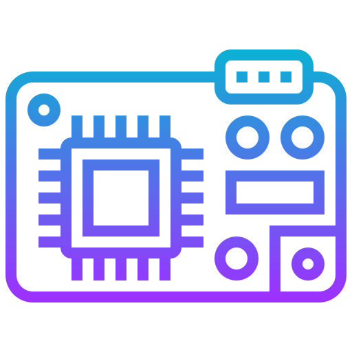

# Sistemas embarcados

Um sistema embarcado é um sistema de computador composto de hardware + software, com uma única função dedicada, operando dentro de um outro sistema, elétrico, mecânico, hidráulico, etc.

## Orientador

Este repositório é destinado a disciplina de **Sistemas Embarcados**, ministrada pelo professor **Alexandre Sales Vasconcelos**.

## Atividade 1

👉 [Descrição do projeto](./atividades/atividade_01/resposta_atividade_01.pdf) 

## Atividade 2

👉 [GPIO e Timer (ATmega328)](./atividades/atividade_02/resposta_atividade_02.pdf) 

## Atividade 3

👉 [USART e SPI - ATmega328](./atividades/atividade_03/resposta_atividade_03.pdf) 

## Atividade 4

👉 [TWI, AC E ADC - ATmega328](./atividades/atividade_04/resposta_atividade_04x.pdf) 
