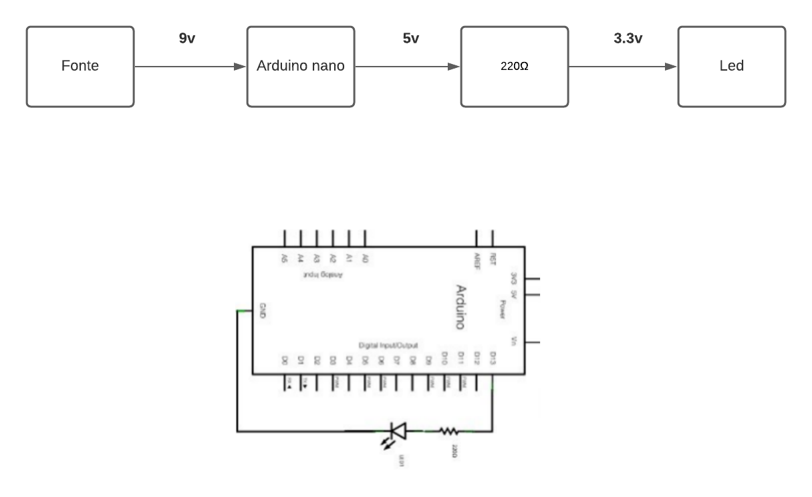
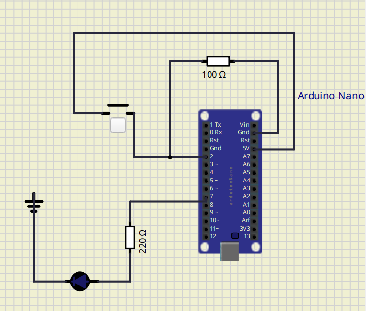

# Exercício 5

## Exemplo a

### Sem interrupção



```c++
#include <Arduino.h>

int led 13;

void setup() {
    pinMode(led, OUTPUT);
}

void loop() {
    digitalWrite(led, 1);
    delay(5000); // 5s
    digitalWrite(led, 0);
    delay(30000);  // 30s
}
```

### Com interrupção

```c++
#include <Arduino.h>

int led = 13;

void interrupcao(){
    digitalWrite(led, HIGH);
    delay(5000); // 5s
}

void setup() {
    pinMode(led, OUTPUT);
    attachInterrupt(0,interrupcao,RISING);
}

void loop() {
    digitalWrite(led, HIGH);
    delay(5000); // 5s
    digitalWrite(led, LOW);
    delay(30000); // 30s
}
```

## Exemplo b



Clique para ver o vídeo do esquemático acima.

<a href="https://www.youtube.com/watch?v=KOhZ9D2qPtw" target="_blank"></a>

### Código

```c++
#include <Arduino.h>

int pinoLed = 7;
int pinoChave = 2;
int stateSwap = 0;
int timeH = 2000;
int timeL = 1000;

void setup() {
    pinMode(pinoLed, OUTPUT);
    pinMode(pinoChave, INPUT_PULLUP);
    attachInterrupt(digitalPinToInterrupt(pinoChave), blk, FALLING);
}

void loop(){
    digitalWrite(pinoLed, HIGH);
    delay(timeH);
    digitalWrite(pinoLed, LOW);
    delay(timeL);
}

void blk() {
    stateSwap = !stateSwap;
    if (stateSwap == 1) {
        timeH = 2000;
        timeL = 1000;
    } else {
        timeH = 5000;
        timeL = 25000;
    }
}
```

👉 <a href="./exemplo_2/exemplo_5.ino">Arquivo .ino</a><br />
👉 <a href="./exemplo_2/exemplo_5.simu">Arquivo .simu</a><br />
👉 <a href="./exemplo_2/exemplo_5.hex">Arquivo .hex</a>
